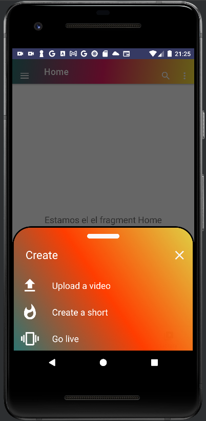
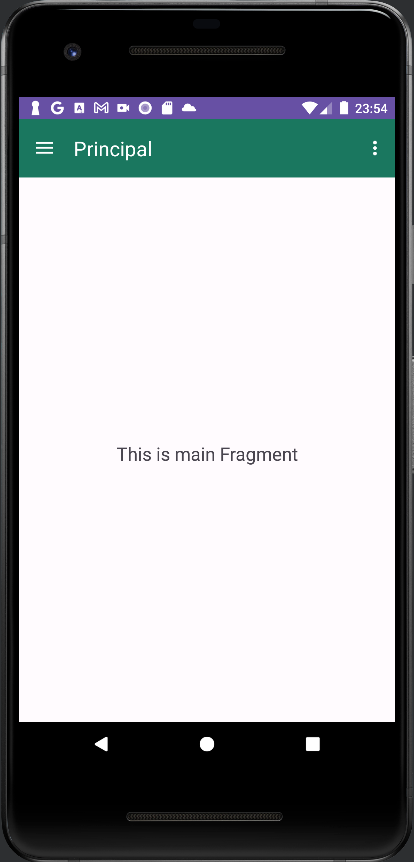

# Proyecto PMDM Tema3 CRUD completo

## Introducción

Proyecto PMDM Tema 3 (`Programación Multimedia y Dispositivos Móviles`). Este proyecto tiene como 
objetivo demostrar la implementación de un sistema de gestión de restaurantes utilizando el patrón 
de diseño Modelo-Vista-Controlador (`MVC`). La aplicación permite realizar operaciones CRUD (Crear,
Leer, Actualizar, Eliminar) sobre una lista de restaurantes. A lo largo de esta documentación, 
exploraremos las clases y componentes clave del proyecto, describiendo sus funciones y 
responsabilidades.


## Descripción General

El proyecto está estructurado en varias clases que representan las capas del patrón `MVC`: modelos 
para los datos de restaurantes y usuarios, vistas para la interfaz de usuario, y controladores 
para gestionar la lógica de negocio y las interacciones entre modelos y vistas.


## Clases Principales

### AdapterRestaurant

#### Descripción
El adaptador `AdapterRestaurant` es esencial para la representación de la lista de restaurantes en 
un RecyclerView. Maneja la creación de vistas individuales y la vinculación de datos a través de su 
ViewHolder asociado.

#### Métodos

- `onCreateViewHolder`: Crea y devuelve un nuevo ViewHolder.
- `onBindViewHolder`: Vincula los datos de un restaurante a una vista específica.
- `getItemCount`: Devuelve el número total de elementos en la lista.

### ViewHRestaurant

#### Descripción
La clase `ViewHRestaurant` es un ViewHolder personalizado para los elementos de la lista de 
restaurantes. Gestiona la asignación de datos y la definición de oyentes para los botones de 
edición y eliminación.

#### Métodos

- `renderize`: Asigna los datos del restaurante a la vista.
- `setOnClickListener`: Define los oyentes para las interacciones de los botones.

### Controller

#### Descripción

La clase `Controller` actúa como el controlador principal, orquestando la lógica de negocio y las 
interacciones con la interfaz de usuario. Se encarga de la gestión de datos y la coordinación entre 
modelos y vistas, algunos de sus métodos clave incluyen:

#### Métodos

- `initData`: Inicializa los datos de la lista de restaurantes.
- `iniciar`: Configura el adaptador y el`RecyclerView`.
- `delRestaurant`: Gestiona la lógica para eliminar un restaurante.
- `updateRestaurant`: Gestiona la lógica para actualizar un restaurante.
- `addRestaurant`: Añade un nuevo restaurante a la lista.
- `mostrarDialogoEliminarRestaurante`: Muestra un diálogo de confirmación para eliminar un
  restaurante.
- `mostrarDialogoEditarRestaurante`: Muestra un diálogo de edición para un restaurante
  existente.
- `mostrarDialogoNewRestaurant`: Muestra un diálogo para agregar un nuevo restaurante.


## Fragmentos y Actividades

- `RestaurantesFragment`: Muestra la lista de restaurantes utilizando el patrón MVC.
- `Login`: Maneja la autenticación de usuarios y redirige al `MainActivity` con la 
  información del usuario autenticado.
- `MainActivity`: La actividad principal que incluye la navegación entre fragmentos.


## Clases de Datos

### `DaoRestaurant` y `Repository`

Estas clases gestionan el acceso a los datos de restaurantes. `DaoRestaurant` proporciona 
métodos para acceder a los datos de la base de datos, mientras que `Repository` almacena 
la lista predefinida de restaurantes.


### User y UserRepository

#### Descripción
Estas clases gestionan los datos de usuarios, con métodos para acceder a la lista de usuarios y 
agregar nuevos usuarios.

## Modelos

### Restaurant y User

#### Descripción
Clases de modelo que representan datos de restaurantes y usuarios respectivamente.

## Conclusiones y Futuras Mejoras

Este proyecto demuestra la implementación de un sistema de gestión de restaurantes con funcionalidades CRUD. 
Se ha estructurado siguiendo el patrón MVC, lo que facilita la modularidad y el mantenimiento del código. 
Como futuras mejoras, se podría considerar la expansión de las funcionalidades, una interfaz de usuario más 
intuitiva y una mayor modularidad del código.

## Imagen de ejecucion de la aplicacion 

## Login


## Register


## RecycleView


___

## Navigation drawers, button,toolbar




## Dialogs


## Fragments



____

### Enlace al repositorio, la version en la rama dev

[REPOSITORIO:https://github.com/johnlopez0505/proyecto_PMDM_john_2023-2024.git](https://github.com/johnlopez0505/proyecto_PMDM_john_2023-2024.git)


# Preferencias compartidas Login

## En esta actividad vamos a realizar la incorporación de preferencias compartidas en el login.

## Clase `Login` (Actividad de Inicio de Sesión)

La clase `Login` es una actividad de Android que gestiona el proceso de inicio de sesión.

### Variables de Clase:
- **bindingLogin**: Utilizado para inflar la interfaz de usuario mediante View Binding.
- **shared**: Almacena las preferencias compartidas para gestionar el estado de inicio de sesión.
- **user**: Almacena el nombre de usuario actual.
- **email**: Almacena la dirección de correo electrónico del usuario actual.

### Método `onCreate`:
- Se ejecuta al iniciar la actividad.
- Infla la vista y carga las preferencias compartidas.

### Método `initEvents`:
- Inicializa los eventos de los botones y controles de la interfaz.

### Método `verificarLogueo`:
- Verifica si el usuario ya está logueado.
- Inicia la actividad principal si ya está logueado, de lo contrario, muestra la interfaz de inicio de sesión.
```kotlin
    private fun verificarLogueo(){
            if(isLogeo()){
                // Si ya está logueado, iniciamos la actividad principal directamente
                startMainActivity()
            }
            else{
                // Si no está logueado, mostramos la interfaz de inicio de sesión
                initEvents()
                loadLastUser()
            }
    }
```
### Método `validarCredenciales`:
- Valida las credenciales del usuario comparándolas con datos almacenados.
- Guarda las preferencias y inicia la actividad principal si las credenciales son válidas.
```kotlin
   private fun validarCredenciales() {
      val user = bindingLogin.editTextUsername.text.toString()
      val password = bindingLogin.editTextPassword.text.toString()
      val usuarioEncontrado =  DaoUser.myDao.getDataUser().find {
        it.name==user && it.password ==password }
      val email = usuarioEncontrado?.email.toString()
      if (usuarioEncontrado != null) {
        // Guardar el último usuario ingresado
        guardarUltimoUsuario(user, password,email)
        // El usuario ha iniciado sesión con éxito
        //guardamos las preferencias
        saveLoginState(email)
        // Credenciales válidas, iniciar Activity principal
        val intent = Intent(this, MainActivity::class.java)
        intent.putExtra("name",user)
        intent.putExtra("email",email)
        startActivity(intent)
      } else {
        // Las credenciales no son válidas
        Toast.makeText(this, "Credenciales no válidas",
          Toast.LENGTH_SHORT).show() }
  }
```

### Método `registerUser`:
- Inicia la actividad de registro de usuario.

### Método `getLastUsername`:
- Obtiene el último nombre de usuario, contraseña y correo electrónico almacenados.

### Método `guardarUltimoUsuario`:
- Guarda el último nombre de usuario, contraseña y correo electrónico en las preferencias compartidas.

### Método `loadLastUser`:
- Recupera el último usuario almacenado y establece los valores en la interfaz de usuario.

### Método `cargarPreferenciasCompartidas`:
- Inicializa la variable `shared` con las preferencias compartidas.
```kotlin
   private fun cargarPreferenciasCompartidas(){
    
      val fichePreferencias : String = getString(R.string.preferencias_fichero_login)
      shared = this.getSharedPreferences(fichePreferencias, MODE_PRIVATE)
   }
```
### Método `isLogeo`:
- Verifica el estado de inicio de sesión en las preferencias compartidas.
```kotlin
    private fun isLogeo(): Boolean {
      // Obtener el estado de inicio de sesión almacenado en SharedPreferences
      return shared.getBoolean(getString(R.string.preferencia_login),false)
    }
```
### Método `startMainActivity`:
- Inicia la actividad principal con datos del último usuario.
```kotlin
   private fun startMainActivity() {
      loadLastUser()
      val email = shared.getString(getString(R.string.preferencias_email), "")
      // Iniciar la actividad principal
      val intent = Intent(this, MainActivity::class.java)
      intent.putExtra("name",user)
      intent.putExtra("email",email)
      startActivity(intent)
    
      // Finalizar esta actividad para que no vuelva atrás con el botón de retroceso
      finish()
   }
```

### Método `saveLoginState`:
- Guarda el estado de inicio de sesión y el correo electrónico en las preferencias compartidas.

### Método `cerrarSesion`:
- Cierra la sesión del usuario limpiando las preferencias compartidas.
- Inicia la actividad de inicio de sesión.

```kotlin
   private fun cerrarSesion() {
      // Obtenemos un editor de SharedPreferences
      val editor = shared.edit()
    
      // Limpiamos el estado de inicio de sesión
      editor.putBoolean(getString(R.string.preferencia_login), false)
    
      // Aplicamos los cambios
      editor.apply()
    
      val intent = Intent(activity, Login::class.java)
      startActivity(intent)
    
      showToast("Sesión cerrada exitosamente")
   }
```

---

# Clase `LogoutFragment` (Fragmento para Cerrar Sesión)

La clase `LogoutFragment` es un fragmento que proporciona la opción para cerrar sesión.

### Variables de Clase:
- **binding**: Utilizado para inflar la interfaz de usuario mediante View Binding.
- **shared**: Almacena las preferencias compartidas para gestionar el estado de inicio de sesión.
- **login**: Instancia de la clase `Login` para acceder a sus métodos.

### Método `onCreateView`:
- Se ejecuta al crear la vista del fragmento.
- Infla la vista mediante View Binding.

### Método `onViewCreated`:
- Se ejecuta después de que la vista ha sido creada.
- Configura la interfaz y eventos del fragmento.

### Método `cerrarSesion`:
- Cierra la sesión del usuario limpiando las preferencias compartidas.
- Inicia la actividad de inicio de sesión.
- Muestra un mensaje Toast indicando que la sesión se cerró correctamente.

### Método `showToast`:
- Muestra un mensaje Toast con el texto proporcionado.

Este es un resumen de la funcionalidad de cada sección y método en la clase `Login` 
y el fragmento `LogoutFragment`.

[REPOSITORIO]()
