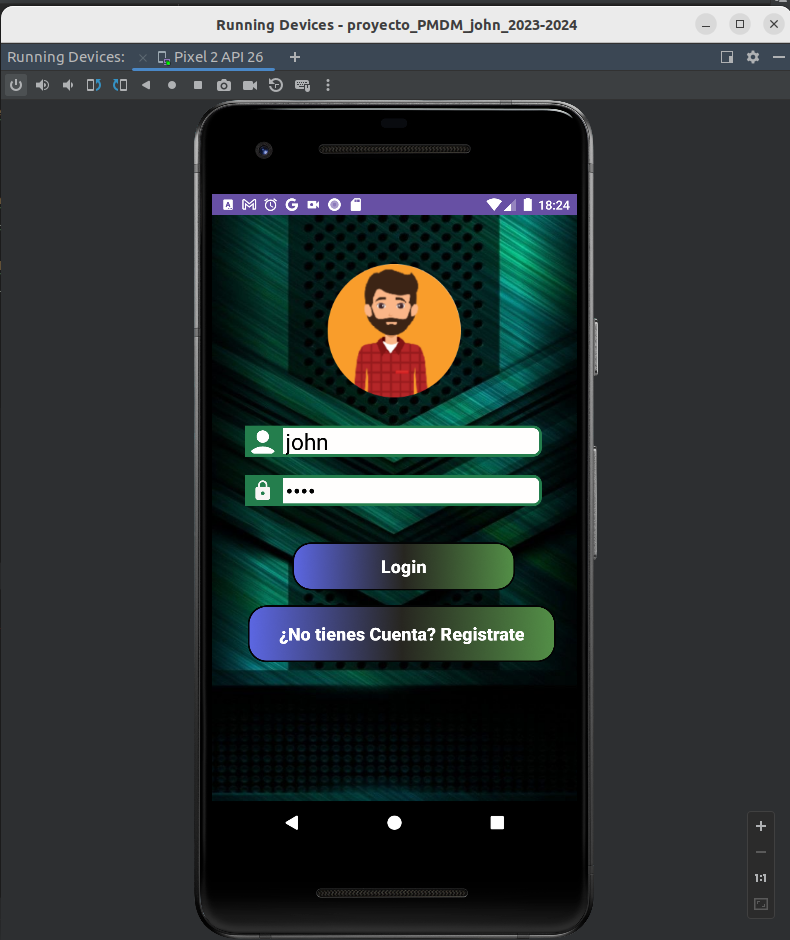
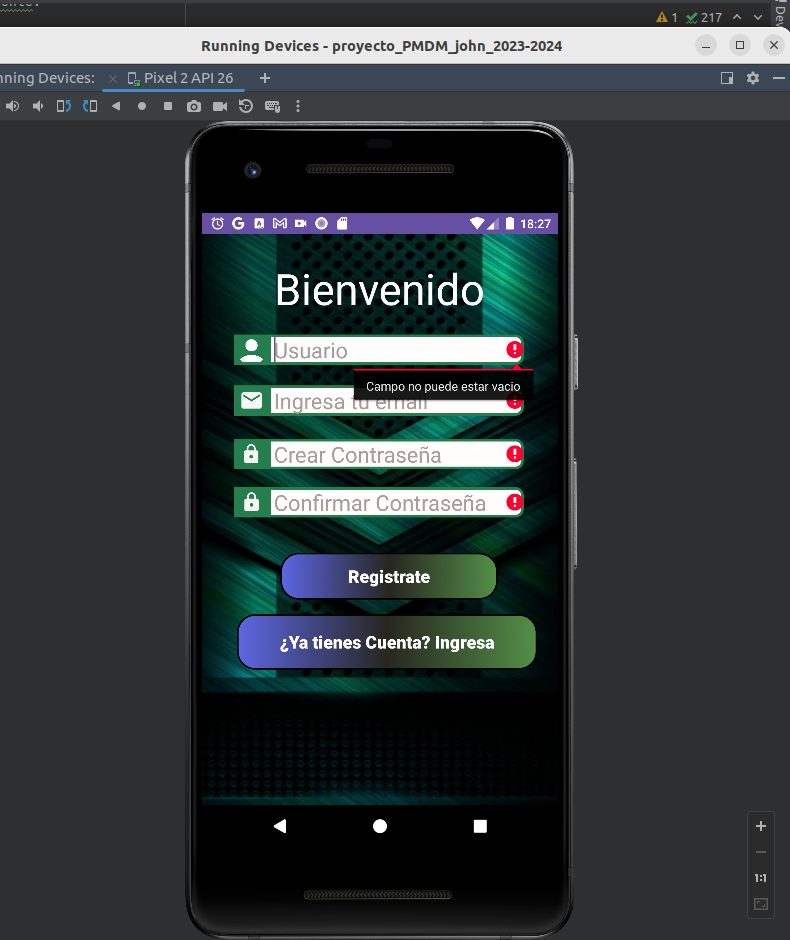
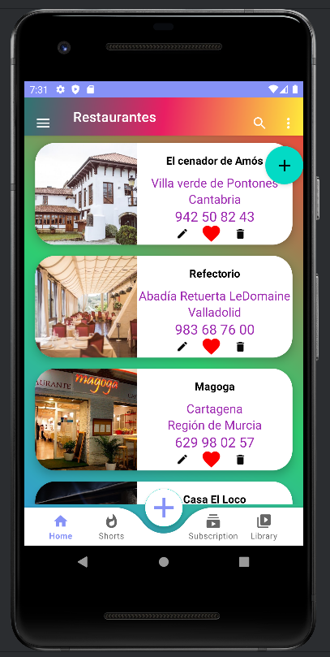
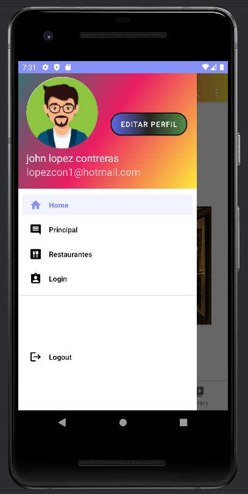
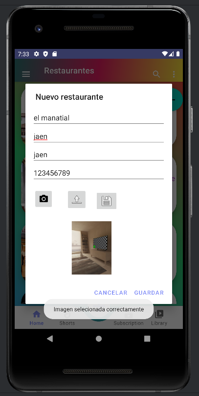
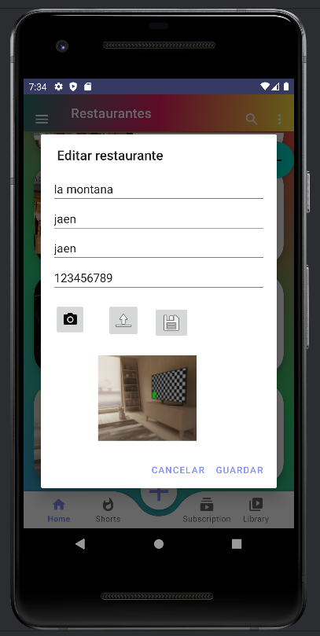
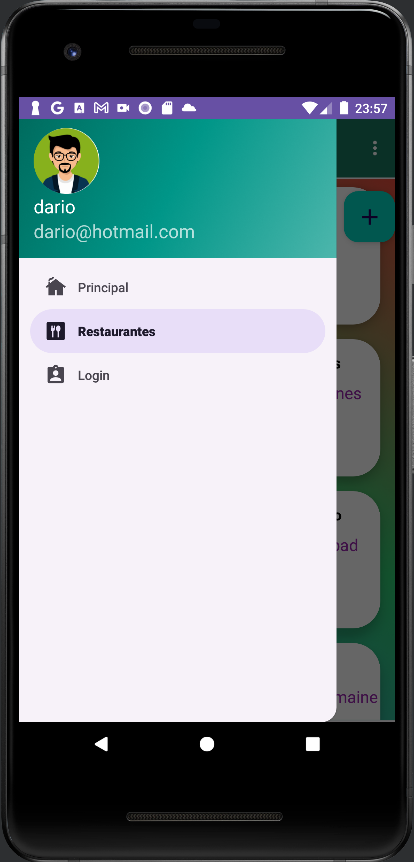
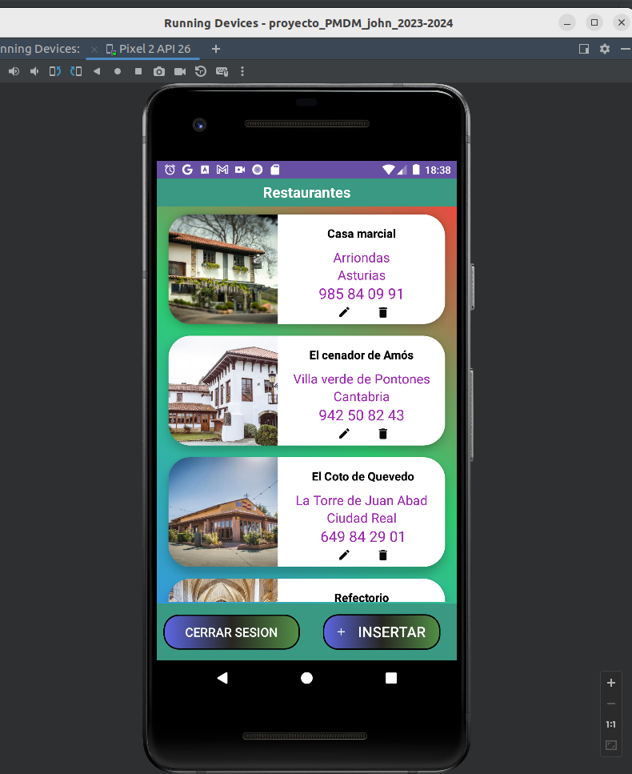
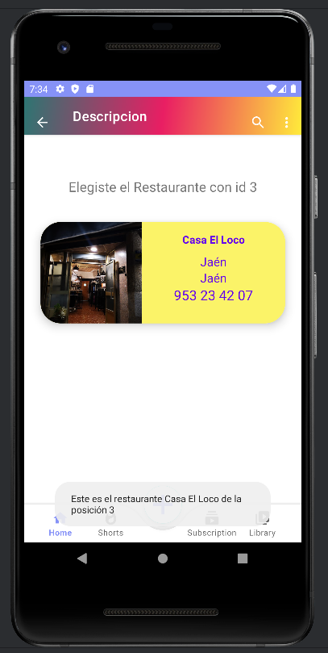
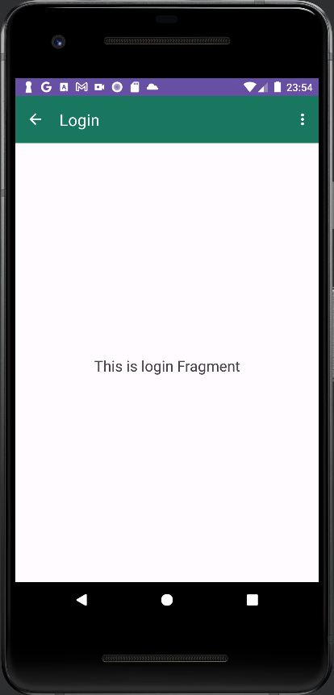

# Proyecto PMDM con Retrofit

## Descripción General

Este proyecto utiliza Retrofit para realizar operaciones de CRUD (Crear, Leer, Actualizar, Eliminar) en una API de 
restaurantes. Está estructurado en varias clases que interactúan para gestionar las solicitudes a la API y actualizar 
la interfaz de usuario en consecuencia.

## Clases y Métodos Principales

### `RestaurantApiAplicacion`

Esta clase extiende la clase `Application` y se utiliza para inicializar la aplicación.

### Modelos de Datos

- `RequestInsertRestaurant`: Modelo de datos para insertar un nuevo restaurante.
- `RequestLoginUser`: Modelo de datos para iniciar sesión.
- `ResponseRest`: Modelo de datos para la respuesta de la API al realizar operaciones en un restaurante.
- `ResponseLogin`: Modelo de datos para la respuesta de la API al iniciar sesión.

### `RestaurantApiService`

Esta clase se encarga de realizar llamadas a la API de restaurantes utilizando Retrofit. Contiene métodos para obtener 
la lista de restaurantes, agregar, eliminar y editar restaurantes.

### `RestaurantRepository`

Este repositorio actúa como una capa intermedia entre la clase `RestaurantApiService` y la vista (`RestaurantesFragment`
). Gestiona las solicitudes a la API y devuelve los resultados al ViewModel.

### Casos de Uso

- `ListRestaurantUseCase`: Caso de uso para obtener la lista de restaurantes.
- `EditRestaurantUseCase`: Caso de uso para editar un restaurante.
- `DeleteRestaurantUseCase`: Caso de uso para eliminar un restaurante.
- `CreateRestaurantUseCase`: Caso de uso para agregar un nuevo restaurante.

### `RetrofitModule`

Este módulo proporciona la configuración de Retrofit y las interfaces de servicio necesarias para interactuar con la API
de restaurantes.

### `RestaurantViewModel`

Este ViewModel se encarga de gestionar la lógica de negocio relacionada con la gestión de restaurantes. Contiene métodos
para listar, agregar, eliminar y editar restaurantes, así como LiveData para observar los cambios en los datos.
````kotlin
  @HiltViewModel
  class RestaurantViewModel @Inject constructor(
      private val listRestaurantUseCase: ListRestaurantUseCase,
      private var editRestaurantUseCase:  EditRestaurantUseCase,
      private var addRestaurantUseCase: CreateRestaurantUseCase,
      private var deleteRestaurantUseCase: DeleteRestaurantUseCase
    ): ViewModel() {
        
      var restaurantListLiveData = MutableLiveData<List<Restaurant>>() //repositorio observable.
      private var listRestaurantes: MutableList<Restaurant> = mutableListOf() // lista de objetos
      var progressBarLiveData = MutableLiveData<Boolean>() //progressbar observable
      private  var tokenUser: String? = null
  
      init {
        listarRestarurants()
      }
  
      fun listarRestarurants() {
        viewModelScope.launch {
          progressBarLiveData.value = true //LiveData notifica del cambio.
          delay(1000)
          val data : List<Restaurant>? = listRestaurantUseCase.invoke(tokenUser!!)
          data.let {
            //Invocamos a nuestro caso de uso (lógica de negocio).
            restaurantListLiveData.value = it
            progressBarLiveData.value = false //LiveData notifica del cambio.
          }
        }
      }
  
      fun addRestaurant(recyclerView: RecyclerView, context: FragmentActivity, token: String?, id: String?
      ) {
        viewModelScope.launch  {
          DialogNewRestaurant()
            .mostrarDialogoNewRestaurant (
              recyclerView,context,addRestaurantUseCase,restaurantListLiveData,token,id
            )
        }
      }
    
      fun delRestaurant(pos: Int, recyclerView: RecyclerView, context: Context,token: String?) {
        DialogDeleteRestaurant()
          .mostrarDialogoEliminarRestaurante(
            pos, recyclerView, context, deleteRestaurantUseCase, restaurantListLiveData,token
          )
      }
    
      fun updateRestaurant(pos: Int, recyclerView: RecyclerView, context: Context, token: String?, id: String?
      ) {
        DialogEditRestaurant()
          .mostrarDialogoEditarRestaurante(
            pos, recyclerView, context,editRestaurantUseCase,restaurantListLiveData,token,id
          )
      }
  }
````
### `RestaurantesFragment`

Este fragmento muestra la lista de restaurantes y permite al usuario realizar operaciones CRUD en ellos. Utiliza el 
ViewModel `RestaurantViewModel` para interactuar con los datos y actualizar la interfaz de usuario en consecuencia.

```kotlin
  @AndroidEntryPoint
  class RestaurantesFragment : Fragment() {
      override fun onViewCreated(view: View, savedInstanceState: Bundle?) {
        super.onViewCreated(view, savedInstanceState)
    
        adapter = AdapterRestaurant( { pos -> delRestaurant(pos) },
          { pos -> updateRestaurant(pos)},{pos ->sendInfoRestaurant(pos)})
        initRecyclerView() //inicializamos el recyclerView. De memento, contendrá lista empty.
        init()
        restaurantViewModel.listarRestarurants()
    
      }
    
      private fun cargarPreferenciasCompartidas() {
        val fichePreferencias : String = getString(R.string.preferencias_fichero_login)
        shared = contexto.getSharedPreferences(fichePreferencias, AppCompatActivity.MODE_PRIVATE)
      }
    
      private fun initRecyclerView(){
        binding.myRecyclerView.layoutManager = LinearLayoutManager( requireContext())
        recyclerView = binding.myRecyclerView.findViewById(R.id.my_recycler_view)
        recyclerView.layoutManager = LinearLayoutManager(context)
        recyclerView.adapter = adapter
    
      }
    
    
      private fun init(){
        contexto = requireActivity() as MainActivity
        cargarPreferenciasCompartidas()
        registerLiveData()
        val token = shared.getString(getString(R.string.token),"")
        restaurantViewModel.iniciar(adapter,token)
      }
      private fun delRestaurant(pos:Int){
        val token = shared.getString(getString(R.string.token),"")
        restaurantViewModel.delRestaurant(pos,recyclerView,contexto,token)
        post = pos
      }
    
      private fun updateRestaurant(pos: Int){
        val token = shared.getString(getString(R.string.token),"")
        val id = shared.getString("id","")
        restaurantViewModel.updateRestaurant(pos,recyclerView,contexto,token,id)
        post = pos
      }
      private fun registerLiveData() {
        restaurantViewModel.restaurantListLiveData.observe(requireActivity()) {
            myList ->
          Log.i(TAG, "registerLiveData: $myList")
          listRestaurants = myList.toMutableList()
          adapter.restaurantRepository = myList!! //aseguro los datos.
          adapter.notifyDataSetChanged()
          adapter.notifyItemChanged(myList.size -1)
          adapter.notifyItemRemoved(post)
          adapter.notifyItemChanged(post)
        }
    
        restaurantViewModel.progressBarLiveData.observe(requireActivity()) {
            visible ->
          binding.progressBar.isVisible = visible
          Log.i("TAG-DOGS", "ProgressBar esta $visible")
        }
    
        binding.fab.setOnClickListener{
          val token = shared.getString(getString(R.string.token),"")
          val id = shared.getString("id","")
          Log.i(TAG, "id usuario  : $id")
          restaurantViewModel.addRestaurant(recyclerView,requireActivity(),token,id)
        }
      }
    
      private fun sendInfoRestaurant(pos: Int) {
        val myActivity = requireActivity()
        val navHost = myActivity //referencia del activity
          .supportFragmentManager //administrador de Fragmentos
          .findFragmentById(R.id.nav_host_fragment_content_main)
    
        navHost.let {//Si entramos dentro, no es nulo.
          navController = navHost!!.findNavController() //buscamos su NavController
          val (name, city, province, phone, image) = adapter.restaurantRepository[pos]
          navController.navigate(
            RestaurantesFragmentDirections.actionNavRestaurantesToDescripcionFragment(
              data = arrayOf("$pos", name, city, province, phone, image)))
        }
        Toast.makeText(
          context, "Este es el restaurante ${listRestaurants[pos].nombre}" +
                  " de la posición $pos", Toast.LENGTH_LONG
        ).show()
      }
  }
```


# Preferencias compartidas Login

## En esta actividad vamos a realizar la incorporación de preferencias compartidas en el login.

## Clase `Login` (Actividad de Inicio de Sesión)

La clase `Login` es una actividad de Android que gestiona el proceso de inicio de sesión.

### Variables de Clase:
- **bindingLogin**: Utilizado para inflar la interfaz de usuario mediante View Binding.
- **shared**: Almacena las preferencias compartidas para gestionar el estado de inicio de sesión.
- **user**: Almacena el nombre de usuario actual.
- **email**: Almacena la dirección de correo electrónico del usuario actual.

### Método `onCreate`:
- Se ejecuta al iniciar la actividad.
- Infla la vista y carga las preferencias compartidas.

### Método `initEvents`:
- Inicializa los eventos de los botones y controles de la interfaz.

### Método `verificarLogueo`:
- Verifica si el usuario ya está logueado.
- Inicia la actividad principal si ya está logueado, de lo contrario, muestra la interfaz de inicio de sesión.
```kotlin
    private fun verificarLogueo(){
            if(isLogeo()){
                // Si ya está logueado, iniciamos la actividad principal directamente
                startMainActivity()
            }
            else{
                // Si no está logueado, mostramos la interfaz de inicio de sesión
                initEvents()
                loadLastUser()
            }
    }
```
### Método `validarCredenciales`:
- Valida las credenciales del usuario comparándolas con datos almacenados.
- Guarda las preferencias y inicia la actividad principal si las credenciales son válidas.
```kotlin
   private fun validarCredenciales(login: User) {
      val user = login.name
      val password = bindingLogin.password.text.toString()
      val email = login.email
      // Guardar el último usuario ingresado
      guardarUltimoUsuario(email!!, password, login.name!!,login.imagen)
      // El usuario ha iniciado sesión con éxito
      //guardamos las preferencias
      saveLoginState(user!!,login.imagen,login.token,login.id)
      // Credenciales válidas, iniciar Activity principal
      val intent = Intent(this, MainActivity::class.java)
      intent.putExtra("name", login.name)
      intent.putExtra("email", email)
      intent.putExtra("image", login.imagen)
      startActivity(intent)
   }
```

### Método `registerUser`:
- Inicia la actividad de registro de usuario.

### Método `getLastUsername`:
- Obtiene el último nombre de usuario, contraseña y correo electrónico almacenados.

### Método `guardarUltimoUsuario`:
- Guarda el último nombre de usuario, contraseña y correo electrónico en las preferencias compartidas.

### Método `loadLastUser`:
- Recupera el último usuario almacenado y establece los valores en la interfaz de usuario.

### Método `cargarPreferenciasCompartidas`:
- Inicializa la variable `shared` con las preferencias compartidas.
```kotlin
   private fun cargarPreferenciasCompartidas(){
    
      val fichePreferencias : String = getString(R.string.preferencias_fichero_login)
      shared = this.getSharedPreferences(fichePreferencias, MODE_PRIVATE)
   }
```
### Método `isLogeo`:
- Verifica el estado de inicio de sesión en las preferencias compartidas.
```kotlin
    private fun isLogeo(): Boolean {
      // Obtener el estado de inicio de sesión almacenado en SharedPreferences
      return shared.getBoolean(getString(R.string.preferencia_login),false)
    }
```
### Método `startMainActivity`:
- Inicia la actividad principal con datos del último usuario.
```kotlin
   private fun startMainActivity() {
  loadLastUser()
    val imagen = shared.getString(getString(R.string.preferencia_imagen),"")
    val email = shared.getString(getString(R.string.preferencias_email), "")
    val token = shared.getString(getString(R.string.token),"")
    // Iniciar la actividad principal
    val intent = Intent(this, MainActivity::class.java)
    intent.putExtra("name",email)
    intent.putExtra("email",user)
    intent.putExtra("image",imagen)
    startActivity(intent)
  // Finalizar esta actividad para que no vuelva atrás con el botón de retroceso
  finish()
   }
```

### Método `saveLoginState`:
- Guarda el estado de inicio de sesión y el correo electrónico en las preferencias compartidas.

### Método `cerrarSesion`:
- Cierra la sesión del usuario limpiando las preferencias compartidas.
- Inicia la actividad de inicio de sesión.

```kotlin
   private fun cerrarSesion() {
      // Obtenemos un editor de SharedPreferences
      val editor = shared.edit()
      // Limpiamos el estado de inicio de sesión
      editor.putBoolean(getString(R.string.preferencia_login), false)
      // Aplicamos los cambios
      editor.apply()
      val intent = Intent(activity, Login::class.java)
      startActivity(intent)
      showToast("Sesión cerrada exitosamente")
   }
```

---

# Clase `LogoutFragment` (Fragmento para Cerrar Sesión)

La clase `LogoutFragment` es un fragmento que proporciona la opción para cerrar sesión.

### Variables de Clase:
- **binding**: Utilizado para inflar la interfaz de usuario mediante View Binding.
- **shared**: Almacena las preferencias compartidas para gestionar el estado de inicio de sesión.
- **login**: Instancia de la clase `Login` para acceder a sus métodos.

### Método `onCreateView`:
- Se ejecuta al crear la vista del fragmento.
- Infla la vista mediante View Binding.

### Método `onViewCreated`:
- Se ejecuta después de que la vista ha sido creada.
- Configura la interfaz y eventos del fragmento.

### Método `cerrarSesion`:
- Cierra la sesión del usuario limpiando las preferencias compartidas.
- Inicia la actividad de inicio de sesión.
- Muestra un mensaje Toast indicando que la sesión se cerró correctamente.

### Método `showToast`:
- Muestra un mensaje Toast con el texto proporcionado.

Este es un resumen de la funcionalidad de cada sección y método en la clase `Login`
y el fragmento `LogoutFragment`.


## Imagen de ejecucion de la aplicacion

## Login




## Register



## RecycleView


___

## Navigation drawers, button,toolbar



## Dialogs





## Fragments




## Camara

____

## Conclusiones

Este proyecto demuestra cómo utilizar Retrofit para realizar operaciones CRUD en una API de restaurantes en una 
aplicación Android. La estructura MVVM ayuda a mantener el código organizado y modular, facilitando su mantenimiento y 
escalabilidad.


[REPOSITORIO:https://github.com/johnlopez0505/proyecto_PMDM_john_2023-2024/tree/retrofit](https://github.com/johnlopez0505/proyecto_PMDM_john_2023-2024/tree/retrofit)

