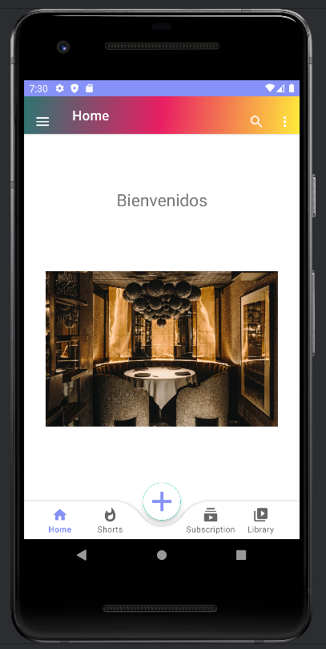

# Proyecto PMDM Tema3

## Introducción

Proyecto PMDM Tema 3 (`Programación Multimedia y Dispositivos Móviles`). Este proyecto tiene como 
objetivo demostrar la implementación de un sistema de gestión de restaurantes utilizando el patrón 
de diseño Modelo-Vista-Controlador (`MVC`). A lo largo de esta documentación, exploraremos las 
clases y componentes clave del proyecto, describiendo sus funciones y responsabilidades.

## Descripción General

El proyecto está estructurado en varias clases que representan las capas del patrón `MVC`: modelos 
para los datos de restaurantes y usuarios, vistas para la interfaz  de usuario, y controladores 
para gestionar la lógica de negocio y las interacciones entre modelos y vistas.

## Clases Principales

### AdapterRestaurant

#### Descripción
El adaptador `AdapterRestaurant` es esencial para la representación de la lista de restaurantes en 
un RecyclerView. Maneja la creación de vistas individuales y la vinculación de datos a través de su 
ViewHolder asociado.

#### Métodos

- `onCreateViewHolder`: Crea y devuelve un nuevo ViewHolder.
- `onBindViewHolder`: Vincula los datos de un restaurante a una vista específica.
- `getItemCount`: Devuelve el número total de elementos en la lista.

### ViewHRestaurant

#### Descripción
La clase `ViewHRestaurant` es un ViewHolder personalizado para los elementos de la lista de 
restaurantes. Gestiona la asignación de datos y la definición de oyentes para los botones de 
edición y eliminación.

#### Métodos

- `renderize`: Asigna los datos del restaurante a la vista.
- `setOnClickListener`: Define los oyentes para las interacciones de los botones.

### Controller

#### Descripción

La clase `Controller` actúa como el controlador principal, orquestando la lógica de negocio y las 
interacciones con la interfaz de usuario. Se encarga de la gestión de datos y la coordinación entre 
modelos y vistas.

#### Métodos

- `initData`: Inicializa los datos de la lista de restaurantes.
- `loggOut`: Muestra mensajes de registro y presenta datos en pantalla.
- `setAdapter`: Configura el adaptador para el RecyclerView.
- `delRestaurant`: Gestiona la lógica para eliminar un restaurante.
- `updateRestaurant`: Gestiona la lógica para actualizar un restaurante.
- `addRestaurant`: Añade un nuevo restaurante a la lista.
- `back`: Cierra la actividad actual y vuelve a la actividad anterior.

## Clases de Datos

### DaoRestaurant y Repository

#### Descripción
`DaoRestaurant` proporciona métodos para acceder a los datos de restaurantes, mientras que 
`Repository` almacena la lista predefinida de restaurantes.

### User y UserRepository

#### Descripción
Estas clases gestionan los datos de usuarios, con métodos para acceder a la lista de usuarios y 
agregar nuevos usuarios.

## Modelos

### Restaurant y User

#### Descripción
Clases de modelo que representan datos de restaurantes y usuarios respectivamente.

## Conclusiones y Futuras Mejoras

En resumen, este proyecto demuestra la implementación de un sistema de gestión de restaurantes 
utilizando el patrón MVC. Se han diseñado clases específicas para manejar la lógica de negocio, la 
interfaz de usuario y los datos. Futuras mejoras podrían incluir la expansión de las 
funcionalidades, una interfaz de usuario más intuitiva y una mayor modularidad en el código. La 
documentación proporcionada sirve como guía para comprender la estructura y el propósito de cada 
componente del proyecto.

## Imagen de ejecucion de la aplicacion 

## Login

## Register

## RecycleView

