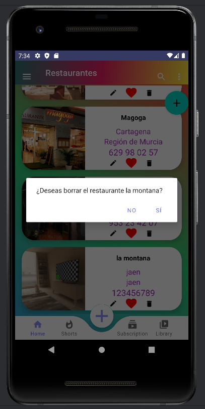
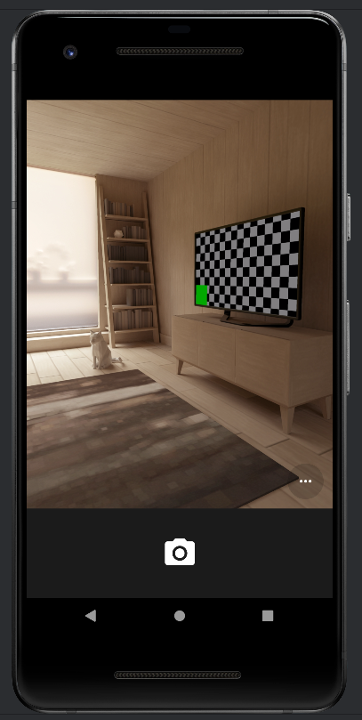

# Proyecto PMDM Tema3 CRUD completo

## Introducción

Proyecto PMDM Tema 3 (`Programación Multimedia y Dispositivos Móviles`). Este proyecto tiene como 
objetivo demostrar la implementación de un sistema de gestión de restaurantes utilizando el patrón 
de diseño Modelo-Vista-Controlador (`MVC`). La aplicación permite realizar operaciones CRUD (Crear,
Leer, Actualizar, Eliminar) sobre una lista de restaurantes. A lo largo de esta documentación, 
exploraremos las clases y componentes clave del proyecto, describiendo sus funciones y 
responsabilidades.

## Descripción General

El proyecto está estructurado en varias clases que representan las capas del patrón `MVC`: modelos 
para los datos de restaurantes y usuarios, vistas para la interfaz de usuario, y controladores 
para gestionar la lógica de negocio y las interacciones entre modelos y vistas.

## Clases Principales

### AdapterRestaurant

#### Descripción
El adaptador `AdapterRestaurant` es esencial para la representación de la lista de restaurantes en 
un RecyclerView. Maneja la creación de vistas individuales y la vinculación de datos a través de su 
ViewHolder asociado.

#### Métodos

- `onCreateViewHolder`: Crea y devuelve un nuevo ViewHolder.
- `onBindViewHolder`: Vincula los datos de un restaurante a una vista específica.
- `getItemCount`: Devuelve el número total de elementos en la lista.

### ViewHRestaurant

#### Descripción
La clase `ViewHRestaurant` es un ViewHolder personalizado para los elementos de la lista de 
restaurantes. Gestiona la asignación de datos y la definición de oyentes para los botones de 
edición y eliminación.

#### Métodos

- `renderize`: Asigna los datos del restaurante a la vista.
- `setOnClickListener`: Define los oyentes para las interacciones de los botones.

### Controller

#### Descripción

La clase `Controller` actúa como el controlador principal, orquestando la lógica de negocio y las 
interacciones con la interfaz de usuario. Se encarga de la gestión de datos y la coordinación entre 
modelos y vistas, algunos de sus métodos clave incluyen:

#### Métodos

- `initData`: Inicializa los datos de la lista de restaurantes.
- `iniciar`: Configura el adaptador y el`RecyclerView`.
- `delRestaurant`: Gestiona la lógica para eliminar un restaurante.
- `updateRestaurant`: Gestiona la lógica para actualizar un restaurante.
- `addRestaurant`: Añade un nuevo restaurante a la lista.
- `mostrarDialogoEliminarRestaurante`: Muestra un diálogo de confirmación para eliminar un
  restaurante.
- `mostrarDialogoEditarRestaurante`: Muestra un diálogo de edición para un restaurante
  existente.
- `mostrarDialogoNewRestaurant`: Muestra un diálogo para agregar un nuevo restaurante.

## Fragmentos y Actividades

- `RestaurantesFragment`: Muestra la lista de restaurantes utilizando el patrón MVC.
- `Login`: Maneja la autenticación de usuarios y redirige al `MainActivity` con la 
  información del usuario autenticado.
- `MainActivity`: La actividad principal que incluye la navegación entre fragmentos.

## Clases de Datos

### `DaoRestaurant` y `Repository`

Estas clases gestionan el acceso a los datos de restaurantes. `DaoRestaurant` proporciona 
métodos para acceder a los datos de la base de datos, mientras que `Repository` almacena 
la lista predefinida de restaurantes.

### User y UserRepository

#### Descripción
Estas clases gestionan los datos de usuarios, con métodos para acceder a la lista de usuarios y 
agregar nuevos usuarios.

## Modelos

### Restaurant y User

#### Descripción
Clases de modelo que representan datos de restaurantes y usuarios respectivamente.

## Conclusiones y Futuras Mejoras

Este proyecto demuestra la implementación de un sistema de gestión de restaurantes con funcionalidades CRUD. 
Se ha estructurado siguiendo el patrón MVC, lo que facilita la modularidad y el mantenimiento del código. 
Como futuras mejoras, se podría considerar la expansión de las funcionalidades, una interfaz de usuario más 
intuitiva y una mayor modularidad del código.

## Imagen de ejecucion de la aplicacion 

## Login

## Register

## RecycleView

___

## Navigation drawers

## Dialogs

## Fragments

____

### Enlace al repositorio

[REPOSITORIO:https://github.com/johnlopez0505/proyecto_PMDM_john_2023-2024.git](https://github.com/johnlopez0505/proyecto_PMDM_john_2023-2024.git)